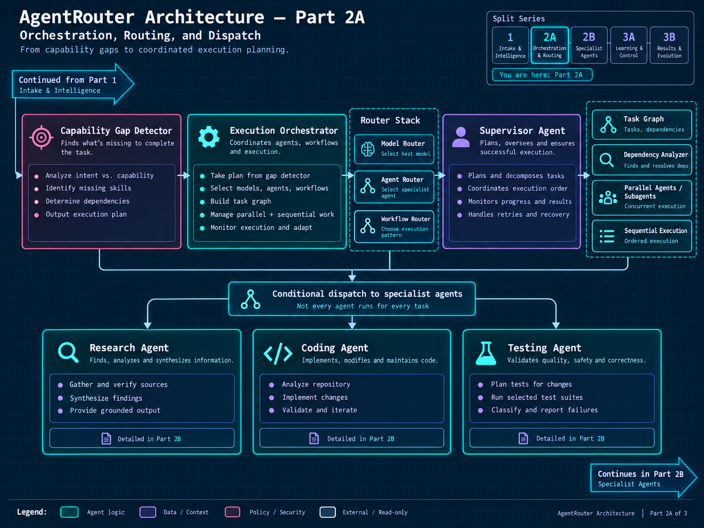
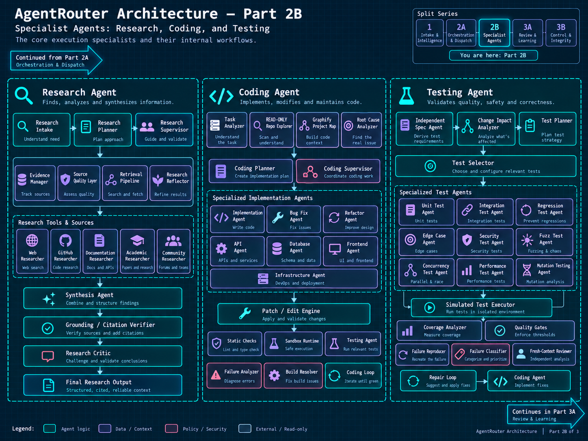
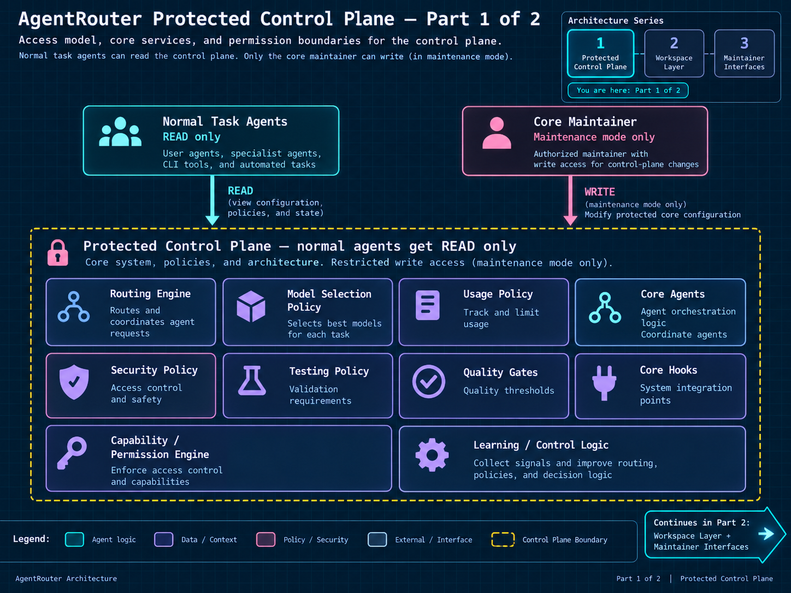
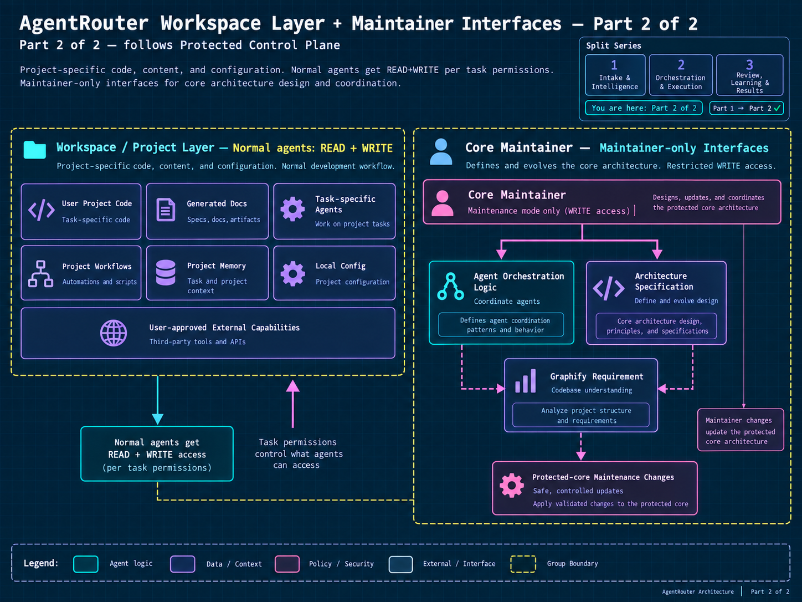

# AgentRouter Architecture

Canonical target-architecture diagrams for AgentRouter OS. This is the
**target design** for the full multi-agent system — see the root
[README.md](../../README.md#milestones) for which parts are actually
implemented today (the routing engine, CLI, doctor, and API are real and
tested; the orchestrator, specialist agents, and protected control plane
below are the direction the project is building toward).

Read in this order:

## 1. Orchestration, Routing, and Dispatch

Capability-gap detection feeds an execution orchestrator and a router stack
(model / agent / workflow routers) plus a supervisor agent, which
conditionally dispatches work to the Research, Coding, and Testing agents.

## 2. Specialist Agents

The internal workflow of each specialist agent: Research (source gathering,
synthesis, citation verification), Coding (implementation planning,
patch/edit, sandboxed testing), and Testing (test selection, execution,
coverage/quality gates, mutation testing).

## 3. Protected Control Plane

Access model for the core system: normal task agents get read-only access to
routing engine, policies, and core agent logic; only the core maintainer can
write to the protected core, and only in maintenance mode.

## 4. Workspace Layer + Maintainer Interfaces

Normal agents get read+write on project-scoped workspace content (code,
docs, task memory) under per-task permissions. Maintainer-only interfaces
govern changes to the protected core itself (agent orchestration logic,
architecture specification).

---

Back to [README.md](../../README.md).
